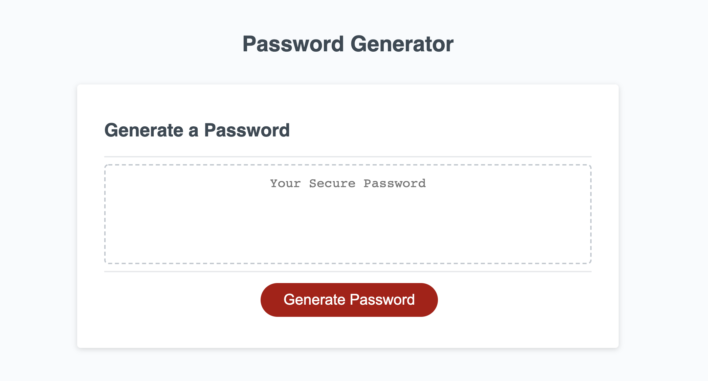

# Random Password Generator

## User Story

As an employee with access to sensitive data, I want to randomly generate a password that meets certain criteria. So that I can create a strong password that provides greater security.

## Table of Content

* [Motivation](#motivation)
* [Description](#description)
* [Requirements](#requirements)
* [Screenshots](#screenshots)
* [Link to Page](#link-to-page)
* [Tools](#tools)

## Motivation

I want employers and users to trust that they can create secure passwords using this password generator. 

## Description

Create an application that an employee can use to generate a random password based on criteria they’ve selected. This app will run in the browser, and will feature dynamically updated HTML and CSS powered by JavaScript code that you write. It will have a clean and polished user interface that is responsive, ensuring that it adapts to multiple screen sizes.

## Requirements 

The password application must have: 

* A button that when clicked a random password is generated.
* A series of prompts for password criteria.
* A prompt for the length of the password (at least 8 characters and no more than 128).
* When prompted for character types to include in the password, must be able to choose lowercase, uppercase, numeric, and/or symbols.
* When prompts are answered, then the input should be validated and at least one character type should be selected.
* When all prompts are answered, then a password is generated that matches the selected criteria.
* When the password is generated, then the password is either displayed in an alert or written to the page.

## Screenshots

## Link to Page

<https://esmendez90.github.io/password-generator/>

## Tools

* Visual Studio Code <https://code.visualstudio.com>.
* Chrome DevTools - Inspect
 